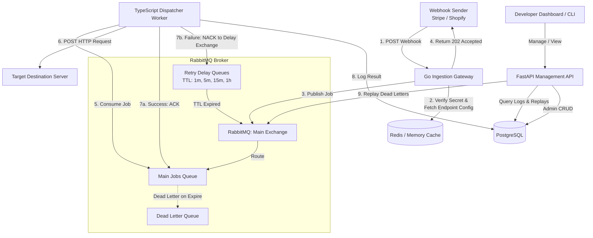

# HookHarbor ⚓

HookHarbor is a high-performance, enterprise-grade **Webhook Reliability Engine and Ingestion Gateway**. It acts as a resilient buffer between third-party webhook senders (like Stripe, Shopify, or GitHub) and your application backends. 

By decoupling webhook ingestion from payload delivery, HookHarbor guarantees that you **never drop a webhook**, even during downstream server outages, database locks, or sudden traffic spikes.

---

## 🚀 Key Features

* **Lightning-Fast Ingestion (`< 10ms`):** Written in Go, the ingestion gateway accepts payloads and immediately queues them, returning a `202 Accepted` response.
* **Durable Buffering:** Built on RabbitMQ, ensuring messages survive service restarts.
* **Resilient Retry Delivery (Exponential Backoff):** Deployed workers process webhooks and handle failures by routing messages to delay queues before retrying.
* **Dead Letter Queue (DLQ):** Webhooks exceeding max retries are safely archived in a DLQ for manual inspection and replay.
* **Control Plane Dashboard:** A FastAPI-powered administration panel and API to manage webhook endpoints, view live delivery logs, and trigger replays.
* **Kubernetes Native Autoscaling:** Configured to scale workers automatically via KEDA based on RabbitMQ queue depth.

---

## 🏗️ Architecture Overview

HookHarbor uses a polyglot microservices architecture to optimize each stage of the lifecycle:



---

## 📂 Repository Structure

```text
HookHarbor/
├── hld.md                   # High-Level Architecture Design
├── lld.md                   # Low-Level Detailed Design (API, DB, Queue schemas)
├── gateway/                 # [Go] Ingestion Gateway service
├── dispatcher/              # [Node.js / TS] Webhook delivery workers
├── management-api/          # [Python / FastAPI] Control plane & Dashboard API
├── db/                      # Database migrations & schemas
├── infra/                   # Kubernetes manifests & Local Docker Compose
└── README.md                # This file
```

---

## 🛠️ Technology Stack

| Service | Technology | Role |
| :--- | :--- | :--- |
| **Ingestion Gateway** | Go | Ultra-fast HTTP ingestion, routing & publishing |
| **Message Broker** | RabbitMQ | Durable queuing, DLX, and TTL-based retry delays |
| **Dispatcher Workers** | Node.js / TypeScript | Webhook payload delivery, HTTP client, ACK/NACK management |
| **Management API** | Python / FastAPI | Control plane, endpoint configuration, metrics & logs |
| **Database** | PostgreSQL | Persistent configuration & delivery history logs |
| **Container Engine** | Docker / Kubernetes | Orchestration, local development & HPA/KEDA scaling |

---

## 🚦 Quick Start (Local Setup)

### Prerequisites
* [Docker & Docker Compose](https://www.docker.com/products/docker-desktop/)
* [Go (v1.21+)](https://golang.org/doc/install)
* [Node.js (v18+) & npm](https://nodejs.org/)
* [Python (v3.10+)](https://www.python.org/downloads/)

### 1. Run Infrastucture
Spin up PostgreSQL and RabbitMQ locally:
```bash
docker-compose -f infra/docker-compose.yml up -d
```

### 2. Set Up the Database
Apply migrations to spin up the schemas:
```bash
cd db/
# Run migration scripts (details in lld.md)
```

### 3. Start Services
Open separate terminal tabs for each service:

* **Ingestion Gateway:**
  ```bash
  cd gateway/
  go run main.go
  ```
* **Management API:**
  ```bash
  cd management-api/
  pip install -r requirements.txt
  uvicorn main:app --reload
  ```
* **Dispatcher Workers:**
  ```bash
  cd dispatcher/
  npm install
  npm run dev
  ```

---

## 📝 License

This project is open-source software licensed under the [MIT License](LICENSE).
